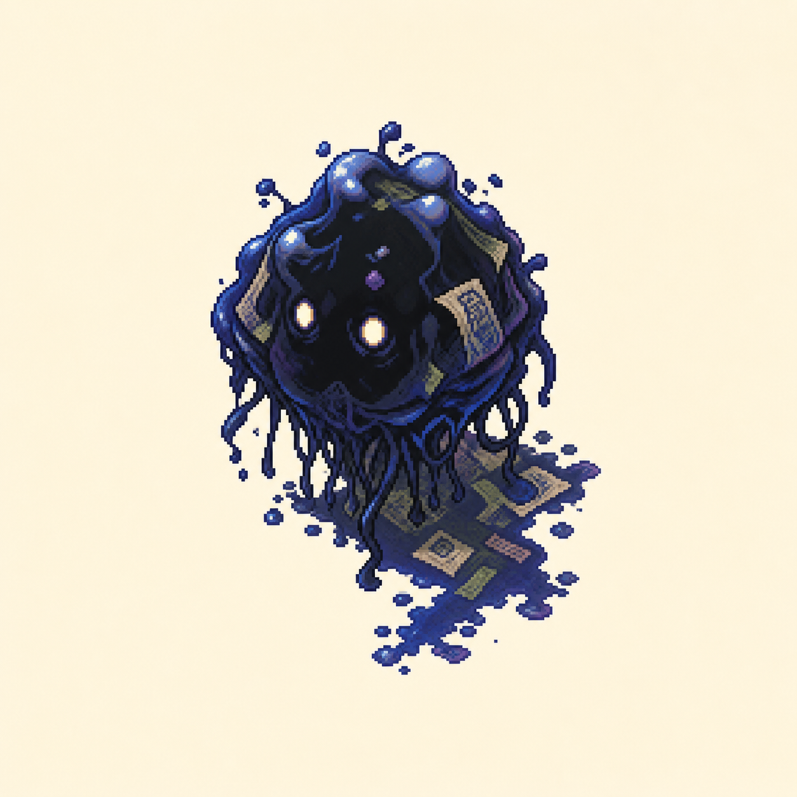
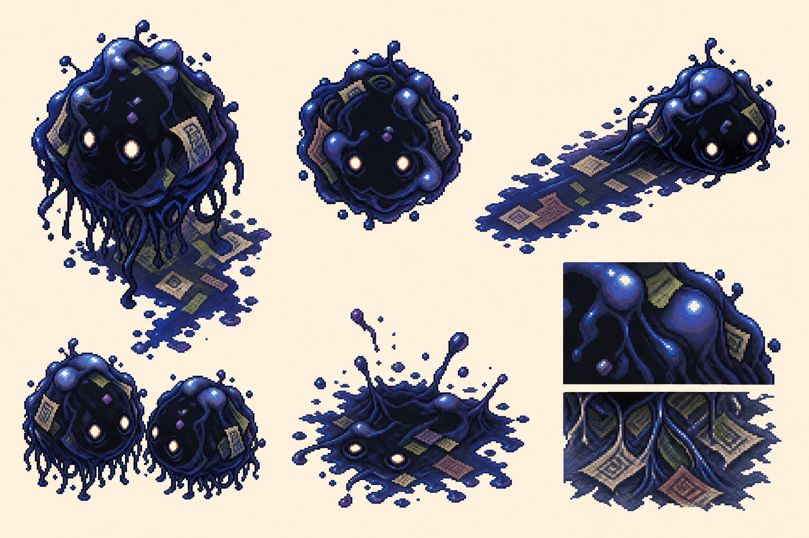
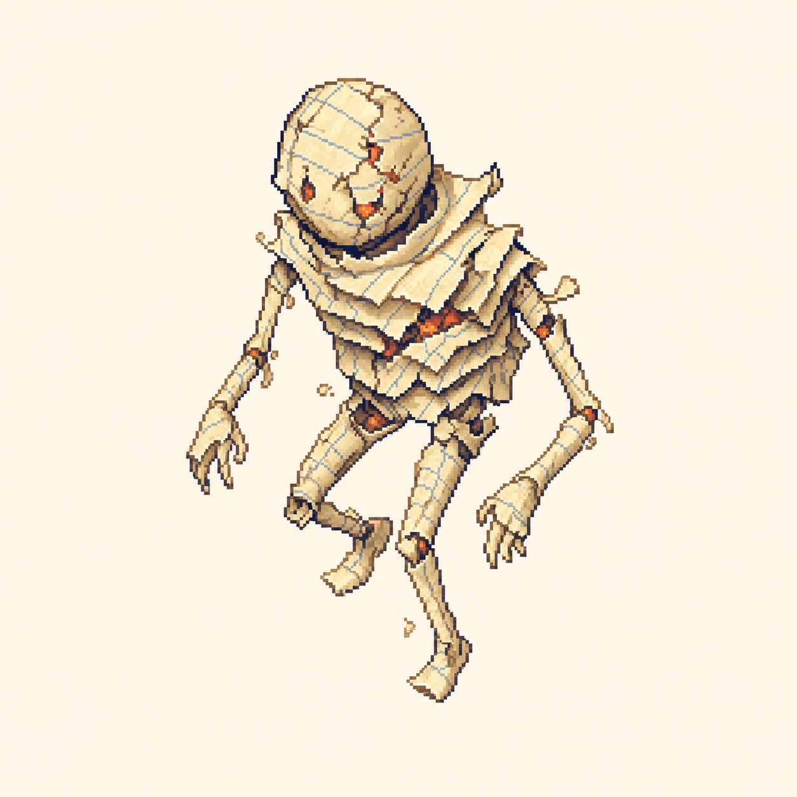
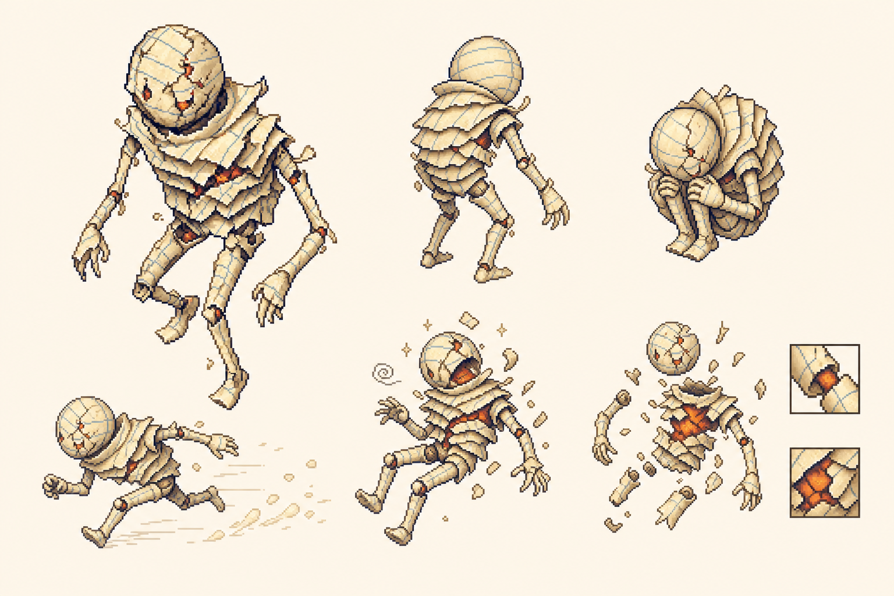
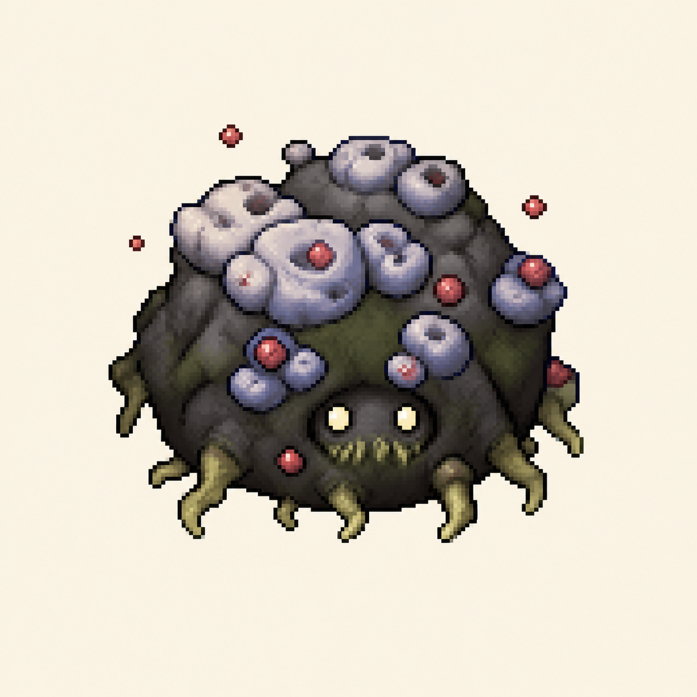
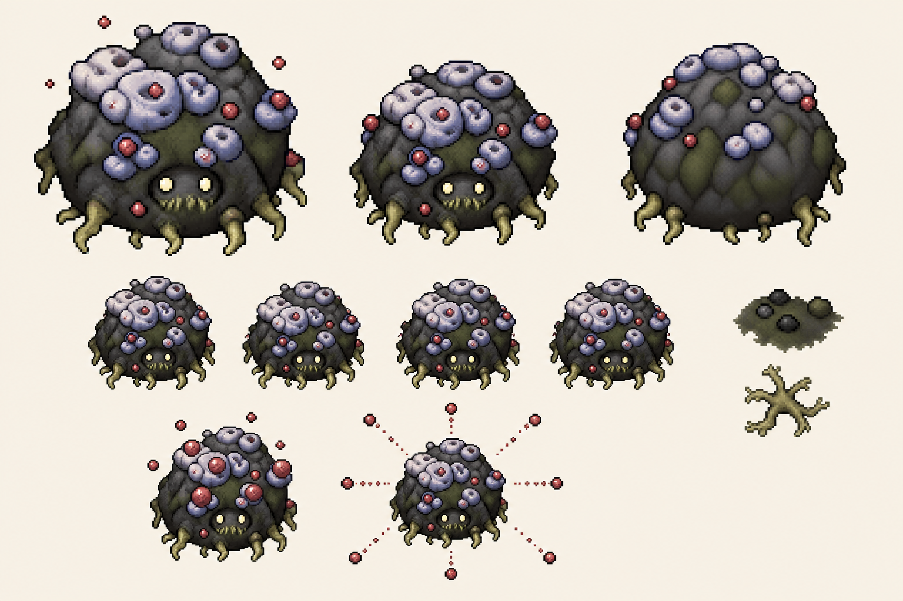

# 核心怪物原画与设定稿 v1

本组稿件以游戏内现有精灵图为造型锚点，统一采用高精度像素原画风格：暖白纸面、深海军蓝至棕黑轮廓、低饱和文具材质、俯视三分之四视角，以及适合俯视动作游戏的小尺度可读轮廓。原画负责确立角色气质与材质，设定稿负责呈现视角、状态、攻击预警与局部结构。

## 墨晕团

- **精灵细化：** 保留精灵图中上重下垂的墨团轮廓、发光眼、湿亮表面和下缘墨丝；嵌入被浸坏的纸片与模糊纹样，让它明确来自“受潮洇墨”，而不是普通史莱姆。
- **玩法对应：** 低攻击、高压地形。拖痕被画成宽而连续的深蓝污染带，强调它会不断侵蚀安全落脚区；聚团姿态则说明多只墨晕团会慢慢合围。
- **反馈重点：** 本体外轮廓厚重缓慢，墨丝与拖痕方向却持续向外生长，形成“敌人不快，但战场在变窄”的观感。飞溅状态可作为受击、死亡与污染残留的特效参考。

## 脆页偶

- **精灵细化：** 保留圆头、长肢体、层叠纸甲和佝偻观察姿态；使用泛黄横线纸、卷边、断纤维与碎屑表现“低湿脆化”，避免读成真正骨骼或肉体亡灵。
- **玩法对应：** 设定稿把观察、抱团折叠蓄力、直线冲锋、撞墙眩晕和死亡爆裂拆成不同轮廓。玩家应能仅凭身体压缩程度判断冲锋是否即将发生。
- **弱点语言：** 红橙纸核平时只从裂缝微露，撞墙或爆裂时才完全显现；它既是眩晕后的输出窗口，也是危险状态的暖色提示。死亡碎片维持短距离散射，避免与远程弹幕混淆。

## 黑斑菌团

- **精灵细化：** 严格以 `003_the_mold_spot_fungus.png` 的四帧精灵为形态基准：单个紧凑圆丘、灰蓝顶部团簇、暗灰与苔绿块状身体、正面小脸，以及从下缘伸出的短菌根。它是一个完整可移动怪物，不再解释成铺满地面的宽大菌毯。
- **红孢子规范：** 灰蓝团簇作为精灵原有的菌体结构保留；进入活跃状态的孢囊中心、脱离本体的孢子与孢子弹使用红色。暗红负责蓄力预警，较亮红负责飞行危险识别。
- **玩法对应：** 四帧呼吸只采用轻微压缩与顶部团簇起伏，避免待机动画改变轮廓；惊醒时红色节点膨胀，随后从保持紧凑的本体向八个方向释放红色孢子。正面和背侧视图用于统一小脸、顶部团簇与短菌根在后续精灵制作中的位置。

## 三者在同一场战斗中的视觉分工

- **墨晕团：** 深蓝拖痕代表持续地形压力。
- **脆页偶：** 米白折纸轮廓与红橙纸核代表瞬时冲锋压力。
- **黑斑菌团：** 暗绿贴地菌毯与红色八向孢子代表周期性区域弹幕。

这三个主色通道互不重叠，因此即使同时出现在低分辨率战斗画面中，玩家也能快速区分“地面污染、直线冲锋、径向毒孢”三类威胁。
